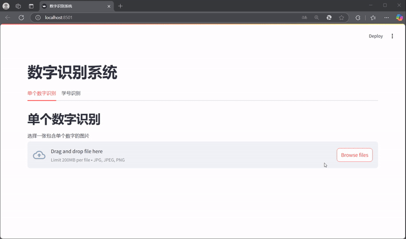

# 机器视觉实验项目（Hefei University of Technology）

本项目包含三个计算机视觉相关的实验任务，涵盖图像处理、特征提取、目标检测和深度学习等多个方面。

## 项目结构

```
Experience/
├── Task-1/                # 滤波
│   ├── task1.py           # 主程序
│   ├── resize.py          # 图像缩放工具
│   ├── texture_features.npy # 保存的特征数据
│   ├── output_images/     # 输出图像目录 
|   ├── t1.jpg       # 测试图像
|   └── test1.jpg
│
├── Task-2/                # 霍夫变换检测车道线
│   ├── task2.py           # 主程序
│   ├── task2.ipynb        # 实验过程记录
│   ├── resize.py          # 图像缩放工具
│   ├── output_images/     # 输出图像目录
|   ├── t2.jpg       # 测试图像
|   └── test2.jpg
│
├── Task-3/                 # 手写数字识别系统
│   ├── front.py           # Web界面实现
│   ├── model.py           # DenseNet模型定义
│   ├── densenet.pt        # 预训练模型权重
│   ├── denseNet.ipynb     # 模型训练记录
│   ├── test_before_padding/ # 对比图片
│   ├── test_after_padding/  # 对比图片
│   └── data/              # MNIST数据集
│
└── README.md              # 项目说明文档
```

## 实验内容

### Task-1：纹理特征提取与分析
- 实现图像的灰度共生矩阵（GLCM）计算
- 提取对比度、相关性、能量、同质性等纹理特征
- 可视化特征提取结果
- 支持不同方向和距离的纹理分析

### Task-2：目标检测与轮廓提取
- 图像预处理（灰度化、二值化、滤波等）
- 基于轮廓检测的目标识别
- 目标区域的特征提取
- 结果可视化与标注

### Task-3：手写数字识别系统
- 基于DenseNet的深度学习模型
- 支持单个数字和连续数字（学号）识别
- Web界面实现
- 完整的图像处理流程展示



## 环境配置

安装依赖：
```bash
pip install -r requirements.txt
```

## 使用说明

### Task-1：纹理特征提取
```bash
cd Task-1
python task1.py
```
- 输入：灰度图像
- 输出：纹理特征数据和可视化结果


### Task-2：目标检测
```bash
cd Task-2
python task2.py
```
- 输入：含有目标物体的图像
- 输出：标注了检测结果的图像

### Task-3：手写数字识别
```bash
cd Task-3
streamlit run front.py
```
- 通过Web界面上传图片进行识别
- 支持单个数字和连续数字的识别
- 若需要训练模型，可以在denseNet.ipynb中训练

## 实验结果

每个任务的处理结果都保存在各自的`output_images`目录中，包括：
- Task-1：纹理特征可视化图像
- Task-2：目标检测结果图像
- Task-3：数字识别过程和结果展示

## 注意事项

1. 图像处理
   - 建议使用清晰的图像作为输入
   - 支持常见图像格式（jpg、png、jpeg）
   - 图像大小建议不超过1920×1080

2. 环境配置
   - 确保已安装所有必要的依赖包
   - GPU加速（可选）：安装CUDA版本的PyTorch

3. 运行说明
   - 每个任务都可以独立运行
   - Task-3需要确保模型权重文件存在
