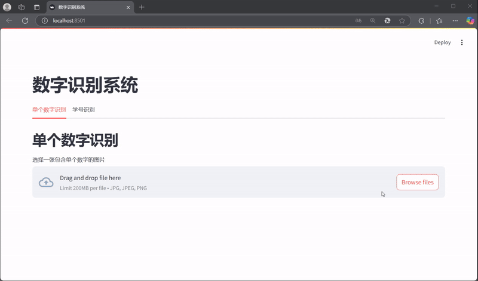

# ComputerVision
## The Report of ComputerVision in Hefei University of Technology

## 项目概览

### Experience

1. **图像滤波与增强**
   - 实现多种经典滤波算法
   - 对比分析不同滤波方法的效果
   - 探索图像增强的最佳实践

2. **基于霍夫变换的车道线检测**
   - 实现完整的图像处理流水线
   - 使用霍夫变换进行直线检测
   - 实现实际道路场景中的车道线识别

3. **基于深度学习的手写数字识别**
   - 使用DenseNet深度学习模型
   - 实现Web交互界面
   - 支持单个和连续数字识别


### Homework

存放11次作业

## 目录结构

```
.
├── Experience/              # 实验项目
│   ├── Task-1/             # 图像滤波实验
│   ├── Task-2/             # 车道线检测实验
│   ├── Task-3/             # 手写数字识别实验
│   └── README.md           # 实验说明文档
│
├── Homework/               # 理论作业
│   ├── 第一次作业.pdf      # 图像处理基础
│   ├── 第二次作业.pdf      # 图像增强
│   ├── 第三次作业.pdf      # 频率域滤波
│   ├── 第四次作业.pdf      # 形态学处理
│   ├── 第五次作业.pdf      # 图像分割
│   ├── 第六次作业.pdf      # 特征提取
│   ├── 第七次作业.pdf      # 目标检测
│   ├── 第八次作业.pdf      # 图像压缩
│   ├── 第九次作业.pdf      # 彩色图像
│   ├── 第十次作业.pdf      # 深度学习
│   └── 第十一次作业.pdf    # 应用实践
│
└── README.md               # 项目说明文档
```
## Quick Start

1. 克隆仓库：
```bash
git clone https://github.com/yourusername/ComputerVision.git
cd ComputerVision
```

2. 安装依赖：
```bash
pip install -r Experience/requirements.txt
```

3. 运行实验：
- Task-1: `python Experience/Task-1/task1.py`
- Task-2: `python Experience/Task-2/task2.py`
- Task-3: `streamlit run Experience/Task-3/front.py`

## 详细文档

- [实验项目文档](Experience/README.md)
- 理论作业：查看Homework目录下对应的PDF文件


